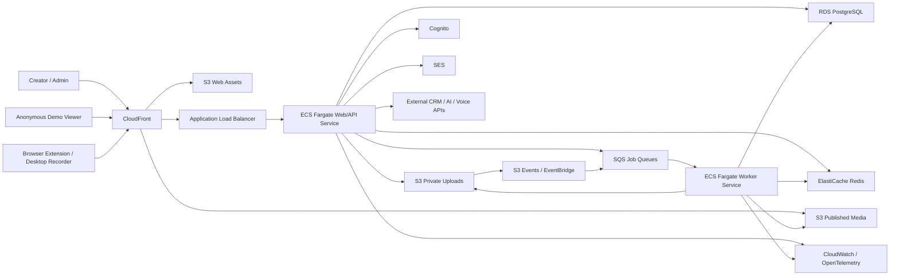
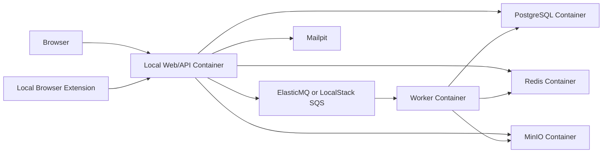

# Architecture for a Supademo-Style Platform

## 1. Purpose and scale assumptions

This architecture supports the feature set in `SUPADEMO_FEATURE_SPEC.md` and is designed for:

- Approximately 1,000 registered users initially
- Up to 100–200 concurrently active authenticated users
- A larger anonymous audience viewing published demos
- Screenshot, audio, and moderate video workloads
- Browser-extension uploads and web-based editing
- Production deployment on AWS
- Completely local development without requiring AWS services
- A small engineering team that needs low operational overhead

The system should begin as a modular monolith with asynchronous workers. At this scale, microservices would add operational cost without a clear benefit. Components can be separated later if traffic, team ownership, or workload isolation requires it.

## 2. High-level architecture



## 3. Recommended technology stack

The exact framework can change, but this stack keeps local and production environments similar.

### Frontend

- React with Next.js and TypeScript
- A canvas or DOM-based editor using React components
- TanStack Query or equivalent for server state
- Zustand, Redux Toolkit, or equivalent for editor state
- Web Workers for expensive client-side editor operations
- IndexedDB for temporary local drafts and upload recovery
- iframe-based published demo player

### Backend

- TypeScript with Node.js
- NestJS, Fastify, or a structured Next.js API service
- REST API initially; WebSocket or Server-Sent Events only where progress updates are needed
- OpenAPI specification for browser extension and external clients
- Background workers using the same language and shared domain packages

### Data and infrastructure

- PostgreSQL as the source of truth
- Redis for cache, rate limiting, short-lived sessions, and job progress
- S3-compatible object storage for images, audio, video, HTML bundles, and exports
- SQS-compatible queues for asynchronous jobs
- FFmpeg for video and audio processing
- Docker and Docker Compose for local development
- Terraform or AWS CDK for AWS infrastructure

## 4. Application boundaries

Use one repository and deploy the application as a modular monolith with the following logical modules:

1. **Identity and tenancy**
   - Users, organizations, workspaces, memberships, invitations, roles, and permissions

2. **Demo authoring**
   - Demos, steps, hotspots, chapters, annotations, branches, themes, variables, and versions

3. **Capture and upload**
   - Browser-extension sessions, multipart uploads, checksums, upload finalization, and retries

4. **Publishing and playback**
   - Immutable published versions, public links, embeds, access gates, custom domains, and player manifests

5. **Media processing**
   - Image optimization, thumbnails, redaction rendering, video transcoding, waveform generation, and audio mixing

6. **Analytics**
   - View sessions, events, aggregation, attribution, completion, drop-off, and exports

7. **Leads and integrations**
   - Forms, identified viewers, webhooks, CRM synchronization, Slack notifications, and Zapier

8. **AI orchestration**
   - Text generation, translation, voice generation, audits, agents, provider adapters, quotas, and safety controls

9. **Administration and billing**
   - Plans, usage limits, seats, audit logs, retention policies, feature flags, and workspace administration

These are code boundaries, not separate network services. Each module should own its domain logic and database access interfaces so it can be extracted later.

## 5. AWS production architecture

### 5.1 DNS, TLS, and edge delivery

- **Route 53** manages application and custom-domain DNS.
- **AWS Certificate Manager** provides TLS certificates.
- **CloudFront** is the public edge for the web application, published media, and demo player.
- **AWS WAF** protects public endpoints from common attacks, bots, and abusive traffic.
- CloudFront should cache immutable published assets aggressively using content-hashed keys.
- Authoring APIs and private assets must not be publicly cached.

Suggested domains:

- `app.example.com` — creator dashboard and editor
- `api.example.com` — authenticated and public APIs
- `demo.example.com` — published demo player
- `assets.example.com` — CloudFront-backed media
- Customer custom domains — mapped through CloudFront with validated certificates

### 5.2 Compute

Run containers on **ECS Fargate**:

- **Web/API service:** minimum two tasks across two Availability Zones
- **Worker service:** one task initially, autoscaling from queue depth
- **Scheduled worker:** EventBridge Scheduler triggers maintenance and aggregation jobs
- **Heavy media worker:** separate task definition with more CPU and memory; run only when jobs exist if cost optimization is important

The Application Load Balancer routes API and application traffic to healthy web tasks. Containers remain stateless; all persistent state lives in PostgreSQL, Redis, or S3.

Recommended starting task sizes, to be validated with load tests:

- Web/API: 2 tasks, each 1 vCPU and 2 GB RAM
- General worker: 1–2 tasks, each 1 vCPU and 2 GB RAM
- Media worker: 1 task, 2–4 vCPU and 4–8 GB RAM

Autoscaling signals:

- Web/API: CPU, memory, request count per target, and latency
- Workers: visible SQS messages and age of oldest message
- Media workers: media queue depth and job duration

### 5.3 Network

- One VPC spanning at least two Availability Zones
- Public subnets contain the ALB and NAT gateways
- Private application subnets contain ECS tasks
- Isolated database subnets contain RDS and ElastiCache
- Security groups allow only required service-to-service traffic
- RDS and Redis have no public endpoints
- Use VPC endpoints for S3, SQS, ECR, CloudWatch, and Secrets Manager where cost and security justify them
- Use one NAT gateway for a lower-cost initial deployment or one per Availability Zone for stronger production resilience

### 5.4 Database

Use **Amazon RDS for PostgreSQL** with:

- Multi-AZ deployment for production
- Automated backups and point-in-time recovery
- Encryption with KMS
- Connection pooling through PgBouncer in the application or RDS Proxy
- Separate database roles for migrations, API runtime, analytics jobs, and read-only support
- Row-level tenant checks enforced in application repositories; optionally add PostgreSQL Row-Level Security as defense in depth

Start with a moderate general-purpose instance and scale after observing CPU, connections, IOPS, and query latency. One relational database is sufficient for 1,000 users.

Important tables include:

- `users`, `organizations`, `workspaces`, `memberships`, `invitations`
- `demos`, `demo_drafts`, `demo_versions`, `published_versions`
- `steps`, `hotspots`, `annotations`, `chapters`, `branches`, `themes`
- `assets`, `uploads`, `processing_jobs`
- `share_links`, `access_gates`, `custom_domains`
- `viewer_sessions`, `analytics_events`, `analytics_daily_rollups`
- `leads`, `form_submissions`, `integration_connections`, `webhook_deliveries`
- `audit_logs`, `usage_counters`, `feature_flags`

Every tenant-owned table should contain `workspace_id`. Use UUIDv7 or ULID identifiers to avoid exposing sequential IDs while retaining index locality.

### 5.5 Object storage and media delivery

Use separate S3 buckets or strict prefixes for:

- Raw private uploads
- Processed private assets
- Published immutable assets
- Exports and temporary files
- Access logs

Requirements:

- Block public access on all buckets
- Serve public assets through CloudFront Origin Access Control
- Use short-lived presigned URLs for direct uploads and private downloads
- Use multipart uploads for large videos
- Validate MIME type, extension, file signature, and size
- Scan uploads before publication
- Enable server-side encryption with KMS where required
- Add lifecycle policies for abandoned uploads, temporary exports, old versions, and deleted workspace data
- Store immutable published assets under versioned keys so publishing never breaks active viewers

### 5.6 Queues and asynchronous processing

Use separate SQS queues to isolate workloads:

- `media-processing`
- `image-processing`
- `analytics-ingestion`
- `analytics-rollup`
- `integration-delivery`
- `email-delivery`
- `ai-jobs`
- `data-export`

Each queue must have:

- A dead-letter queue
- Idempotent job handlers
- Retry and backoff policies
- Job timeout appropriate to the workload
- Correlation IDs for tracing
- Metrics and alarms for queue depth and oldest-message age

### 5.7 Redis

Use **ElastiCache for Redis** for:

- Short-lived application cache
- Rate-limit counters
- Distributed locks
- Upload and media-processing progress
- Presence or lightweight collaboration state
- Temporary playback sessions

Do not use Redis as the source of truth. The platform should remain correct after cache loss.

### 5.8 Authentication and authorization

Use **Amazon Cognito** initially for:

- Email/password login
- Email verification
- Password reset
- Social login if needed
- MFA
- Token issuance

The application database stores workspace memberships and authorization roles. Cognito proves identity; the API decides whether that identity may access a workspace or resource.

For enterprise SAML, either use Cognito federation or a dedicated identity broker. Keep the authentication provider behind an application adapter so it can be replaced without rewriting tenant authorization.

### 5.9 Email and notifications

- **SES** sends invitations, verification messages, share notifications, and lead alerts.
- Slack and CRM messages are dispatched asynchronously through integration workers.
- Persist delivery attempts and use idempotency keys to prevent duplicates.

### 5.10 Secrets and configuration

- Store production secrets in **AWS Secrets Manager**.
- Store non-secret parameters in **SSM Parameter Store**.
- Encrypt secrets using KMS.
- Give ECS tasks only the IAM permissions required by their role.
- Never place AWS credentials, database passwords, or AI provider keys in source control or frontend bundles.

## 6. Local development architecture

Developers should be able to run the full core platform without an AWS account.



### Local services

- PostgreSQL container
- Redis container
- MinIO for S3-compatible object storage
- ElasticMQ or LocalStack for SQS-compatible queues
- Mailpit for inspecting email
- Web/API container
- Worker container
- Optional FFmpeg media-worker container
- Optional mock AI and CRM services

Use Docker Compose profiles so developers can run:

- `core`: web, API, PostgreSQL, Redis, MinIO, queues, and Mailpit
- `media`: core plus FFmpeg workers
- `integrations`: core plus webhook and external-service mocks
- `full`: all local services

### Environment abstraction

Application code should depend on interfaces rather than AWS SDK calls scattered throughout the codebase:

- `ObjectStorage` — MinIO locally, S3 in production
- `JobQueue` — ElasticMQ/LocalStack locally, SQS in production
- `EmailSender` — Mailpit/SMTP locally, SES in production
- `IdentityProvider` — local development auth or Cognito
- `SecretProvider` — `.env` locally, Secrets Manager in production
- `AIProvider` — deterministic mock locally, external model provider in production

Local development should not attempt to emulate CloudFront, ALB, WAF, or Route 53. A reverse proxy such as Caddy or Traefik can provide stable local hostnames and HTTPS when extension testing requires it.

## 7. Core request and processing flows

### 7.1 Creating and editing a demo

1. Creator authenticates and opens a workspace.
2. API verifies workspace membership and permissions.
3. Editor loads the current draft and asset metadata from PostgreSQL.
4. Changes are sent as small commands or patches with optimistic version numbers.
5. API writes the new draft revision and returns the updated version.
6. Client keeps a temporary IndexedDB copy for crash recovery.
7. Periodic snapshots provide version history without storing every mouse movement.

Use optimistic concurrency control to prevent one editor silently overwriting another.

### 7.2 Uploading media

1. Client requests a multipart upload session from the API.
2. API validates quota and returns presigned upload URLs.
3. Client uploads directly to object storage.
4. Client finalizes the upload with the API.
5. API stores metadata and places a processing job on SQS.
6. Worker validates and processes the file.
7. Worker stores derivatives and marks the asset ready.
8. Editor receives progress through polling or Server-Sent Events.

Large media must not pass through the API container.

### 7.3 Publishing a demo

1. API validates the draft and referenced assets.
2. A transaction creates an immutable published-version record.
3. A worker builds a compact player manifest and copies/version-links assets.
4. Published manifest and assets receive content-hashed S3 keys.
5. CloudFront serves the published version.
6. Existing links may point to the latest publication, while version-pinned links remain stable.

### 7.4 Viewing and analytics

1. Viewer loads the player and manifest through CloudFront.
2. Player renders mostly from cached static assets.
3. The player batches analytics events rather than sending every interaction separately.
4. Public ingestion endpoint validates payload size, origin, rate, and demo identity.
5. Events enter SQS and are persisted asynchronously.
6. Scheduled jobs create hourly/daily rollups for dashboards.

This keeps anonymous viewing traffic away from the primary authoring workload as much as possible.

### 7.5 Integration delivery

1. A domain event such as `lead.created` or `demo.completed` is persisted.
2. An outbox worker publishes it to the integration queue.
3. Provider-specific workers send data to HubSpot, Salesforce, Slack, or webhooks.
4. Attempts, responses, and retry state are stored.
5. Repeated delivery uses the same idempotency key.

Use the transactional outbox pattern so database writes and outbound events cannot silently diverge.

## 8. Analytics design for the initial scale

PostgreSQL is adequate initially if raw events are partitioned and dashboards read aggregate tables.

Recommended approach:

- Batch events in the player for several seconds or until page exit
- Assign an anonymous session ID in the browser
- Store identified viewer data separately from behavioral events
- Partition `analytics_events` by month
- Create daily and hourly aggregate tables
- Retain raw events for a configurable period
- Query aggregates for normal dashboards
- Export old raw events to S3 before deletion if required

If event volume grows beyond what PostgreSQL comfortably handles, keep the ingestion contract and move raw analytics to Kinesis Firehose plus S3/Athena, ClickHouse, or a managed analytics store. This migration is not needed for the initial 1,000-user target.

## 9. Collaboration strategy

For the first release:

- Use optimistic locking on demo drafts
- Show who last edited the demo
- Support comments and mentions through normal API requests
- Use Server-Sent Events for job status and lightweight notifications

Only introduce WebSockets and CRDT/OT collaborative editing if simultaneous editing is a validated requirement. Real-time multiplayer editing substantially increases complexity.

## 10. AI architecture

All AI operations should pass through a server-side AI gateway module.

Responsibilities:

- Provider abstraction
- Prompt templates and versioning
- Workspace quotas
- Token and cost accounting
- Input redaction where possible
- Timeouts, retries, and circuit breakers
- Moderation and output validation
- Audit records
- Provider data-retention settings
- Human confirmation for destructive or bulk edits

Short text operations may be synchronous. Translation batches, voice generation, audits, knowledge ingestion, and agent indexing should run through the `ai-jobs` queue.

For AI Demo Agents:

- Store source metadata and permissions in PostgreSQL
- Store source files in S3
- Start with PostgreSQL plus `pgvector` for embeddings
- Retrieve only content permitted for the current workspace/agent
- Preserve citations to source assets
- Log tool calls and handoff decisions
- Isolate agent memory by viewer session

A separate vector database is unnecessary at this scale unless retrieval volume or corpus size becomes unusually large.

## 11. Security model

### Tenant isolation

- Every protected request resolves a workspace context.
- Every tenant-owned query includes `workspace_id`.
- Authorization is checked in the service layer, not only in the UI.
- Presigned URLs are scoped to a specific asset and expire quickly.
- Published content has an explicit public/private access policy.

### Application security

- Validate all API input with schemas
- Use parameterized SQL through an ORM/query builder
- Apply CSRF protection where cookie authentication is used
- Use strict CORS allowlists
- Apply Content Security Policy to editor and player
- Sanitize captured HTML and user-supplied rich text
- Render cloned/sandbox HTML in strongly isolated origins and sandboxed iframes
- Disable dangerous iframe capabilities by default
- Rate-limit login, sharing, forms, analytics, and AI endpoints
- Validate webhook signatures
- Encrypt third-party OAuth tokens
- Record privileged actions in append-only audit logs

HTML cloning and sandbox execution represent the highest security risk. They should be deployed on a separate origin, use restrictive CSP and iframe sandbox attributes, and never share authentication cookies with the creator application.

## 12. Reliability, backup, and recovery

- Run web tasks in at least two Availability Zones
- Use RDS Multi-AZ
- Enable RDS automated backups and point-in-time recovery
- Enable S3 versioning on critical asset buckets
- Define lifecycle and deletion policies
- Store infrastructure as code in the repository
- Keep container images immutable and tagged by commit SHA
- Test database restoration and asset recovery periodically
- Configure dead-letter queue replay procedures

Initial targets:

- Availability target: 99.9%
- Recovery point objective: 15 minutes or better for database data
- Recovery time objective: 4 hours or better

These are engineering targets, not contractual SLAs.

## 13. Observability

- Structured JSON logs with request, workspace, user, demo, and correlation IDs
- CloudWatch Logs for container logs
- CloudWatch metrics and alarms
- OpenTelemetry traces across API, queue, worker, database, and external calls
- Frontend error reporting
- Synthetic checks for login, editor loading, publishing, and demo playback
- Dashboards for latency, error rates, queue depth, job age, database load, cache health, and CloudFront errors

Minimum alarms:

- Elevated API 5xx rate
- High p95 API latency
- No healthy ECS tasks
- RDS CPU, storage, connection, or replica lag problems
- Redis memory pressure
- SQS oldest-message age
- Dead-letter queue messages
- Media-processing failures
- CloudFront 5xx errors
- Certificate or custom-domain validation failures

## 14. CI/CD and environments

Use three isolated environments:

- Local development
- Shared staging on AWS
- Production on AWS

Pipeline stages:

1. Lint and type-check
2. Unit tests
3. Integration tests using local containers
4. Build frontend and container images
5. Dependency and container security scans
6. Push images to ECR
7. Apply infrastructure changes with review
8. Run database migrations as a controlled task
9. Deploy ECS services
10. Run smoke tests
11. Automatically roll back unhealthy deployments

Use rolling or blue/green deployments. Database migrations must be backward-compatible with the currently running application during deployment.

## 15. Suggested repository structure

```text
apps/
  web/                 Creator dashboard, editor, and player UI
  api/                 HTTP API
  worker/              General asynchronous jobs
  media-worker/        FFmpeg and image processing
  browser-extension/   Web capture extension
packages/
  domain/              Domain models and business rules
  database/            Schema, migrations, and repositories
  ui/                  Shared UI and design system
  player/              Embeddable demo player
  storage/             S3/MinIO abstraction
  queue/               SQS/local queue abstraction
  analytics/           Event contracts and aggregation
  integrations/        CRM, Slack, webhook adapters
  ai/                  AI provider adapters and prompts
  config/              Typed configuration
infra/
  terraform/           AWS infrastructure modules and environments
docker/
  compose.yml          Local development services
docs/
  decisions/           Architecture decision records
```

## 16. Capacity and scaling path

The initial architecture should comfortably support approximately 1,000 users if media uploads and anonymous demo traffic are routed through S3/CloudFront and heavy work is asynchronous.

Scale in this order:

1. Increase ECS task count
2. Tune database queries and indexes
3. Increase RDS capacity and add a read replica for reporting
4. Increase worker concurrency by queue
5. Move high-volume analytics out of the primary PostgreSQL database
6. Separate media, analytics, integrations, or AI into independent services only when justified
7. Add multi-region media delivery and disaster recovery if business requirements demand it

Likely first bottlenecks are video processing, unoptimized analytics queries, and database connections—not normal API traffic.

## 17. Scope boundaries for the first production release

Include:

- Screenshot and video guided demos
- Workspaces and roles
- Editor with hotspots, annotations, chapters, and branching
- Direct uploads and asynchronous media processing
- Share links and iframe/popup embeds
- Basic personalization
- Lead forms
- Batched analytics and rollups
- A small set of integrations
- AI text and voice features behind queues and quotas

Defer until the foundation is stable:

- Fully faithful arbitrary-site HTML cloning
- Untrusted free-running sandbox JavaScript
- Real-time multiplayer editing
- Multi-region active-active deployment
- A large public CRUD API
- Custom analytics infrastructure
- Fully autonomous AI agents with broad external actions

These deferred capabilities can use the same storage, queue, identity, publishing, and analytics foundations, but each introduces significant security or operational complexity.

## 18. Key architecture decisions

- Start with a modular monolith, not microservices.
- Keep application containers stateless.
- Upload media directly to S3/MinIO.
- Process expensive work asynchronously.
- Publish immutable, cacheable demo versions.
- Keep PostgreSQL as the initial source of truth and analytics store.
- Use adapters so local services replace AWS services cleanly.
- Isolate cloned HTML and sandbox content on a separate origin.
- Introduce specialized infrastructure only after measured bottlenecks appear.

## 19. Research-led architecture extensions

Public user feedback and competitor research introduced several capabilities after the initial architecture was written. They should extend the modular monolith and worker model rather than create premature microservices.

### 19.1 Recapture and content freshness

- Store optional sanitized source provenance separately from public demo manifests.
- Create a `capture_sources` and `capture_revisions` model with old/new asset references, anchor hints, confidence, and approval state.
- Run recapture, visual diff, stale-link, and missing-asset checks through dedicated queues.
- Never apply an automatic anchor remap below the approved confidence threshold.
- Maintain reverse references so the product can show every demo/publication affected by a shared capture change.
- Published versions remain immutable; accepted recaptures create a new draft revision and require republishing.
- Optional source monitoring must use the same SSRF protections as HTML/resource capture and must be opt-in per approved domain.

### 19.2 A/B experiment routing

- Store experiment configuration and immutable variant publication IDs in PostgreSQL.
- Assign a viewer deterministically using a server-issued anonymous experiment identifier and a keyed hash.
- Resolve the assigned published manifest at the edge/API while preserving one stable share/embed URL.
- Emit an experiment-exposure event before outcome events and never infer exposure only from a page request.
- Keep experiment assignment independent of authorization and access gates.
- Compute results in analytics rollups; store sample size, metric definitions, and experiment version with every report.
- Winner promotion changes routing configuration, not historical publication records.

### 19.3 Export and offline package workers

- Add `document-export`, `media-export`, and `offline-package` queues rather than processing exports in API tasks.
- Build MP4/GIF using constrained media workers and PDF/SOP/SCORM using isolated document workers.
- Generate exports only from immutable published manifests to make output reproducible.
- Store exports privately with short-lived signed download URLs and lifecycle expiration.
- Offline/self-host packages include a signed manifest, content hashes, player version, publication version, expiry metadata, and no creator credentials.
- An optional analytics relay uses a separately scoped public ingestion token; offline playback remains functional when the relay is unavailable.
- Revocation limitations for already downloaded packages must be explicit; future online checks may enforce expiry but cannot guarantee deletion from an offline device.

### 19.4 Mobile rendering variants

- Keep one canonical demo document and store mobile behavior as publication settings and sparse component overrides.
- Avoid duplicating entire demos for mobile.
- Generate mobile swipe/fallback manifests at publication time.
- Treat responsive, scale, zoom, swipe, and fallback as player strategies behind one stable player API.
- Analytics records the selected strategy and normalized interaction coordinates.

### 19.5 Assessments and learning exports

- Keep answer keys and scoring rules out of public manifests where they could reveal answers.
- Score attempts through a server endpoint against an immutable published assessment version.
- Rate-limit attempts and store idempotency keys.
- Generate certificates asynchronously from approved viewer identity fields.
- Emit versioned xAPI-compatible events through the analytics/outbox pipeline.
- Generate SCORM/xAPI packages as exports; do not couple core player runtime to a specific LMS vendor.

### 19.6 Presenter and kiosk sessions

- Model presenter sessions separately from normal anonymous viewer sessions.
- Deliver private notes only to an authenticated presenter channel and never include them in audience/offline public manifests.
- Use BroadcastChannel or a small authenticated realtime channel for dual-screen synchronization.
- Kiosk mode stores no persistent identified viewer state and resets after completion or inactivity.
- Offline presenter packages use the signed offline-package format.

### 19.7 Preview and approval workflow

- Preview links resolve immutable or draft-preview snapshots and write to a separate review-event namespace, not production analytics.
- Approval state belongs to a specific revision hash; any subsequent content change invalidates approval according to workspace policy.
- Publish authorization checks required approvals transactionally.
- Approval and rejection events are append-only audit records.

### 19.8 Simple UI architecture

- The creator application follows the `Record → Edit → Share` route hierarchy defined in `UI_REQUIREMENTS.md`.
- Advanced modules register contextual inspector panels and command-palette actions instead of permanent top-level navigation.
- The editor loads advanced HTML, graph, media timeline, experiment, and AI bundles on demand.
- Simple screenshot-demo creation must not download or initialize sandbox, graph, analytics, or AI authoring code.
- Feature flags and entitlements may hide capabilities, but the underlying document format remains backward-compatible.
- UI performance telemetry should distinguish simple and advanced editor paths so added capabilities cannot silently regress the core journey.
